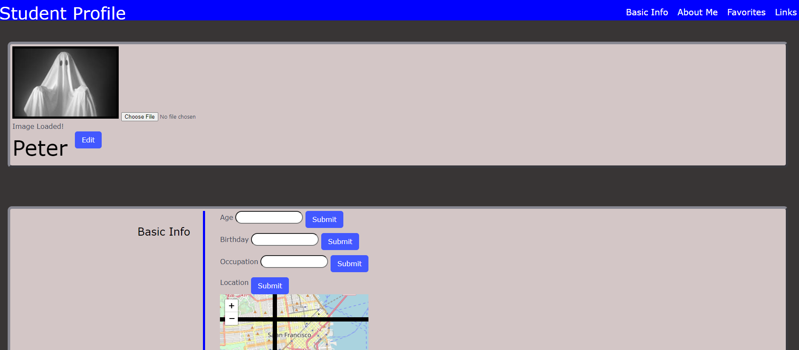
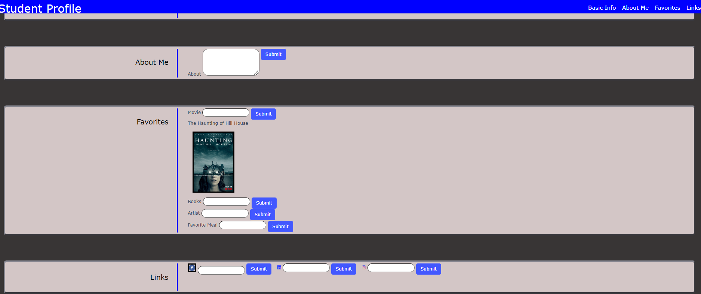

# Project1StudentProfile

# Student Profile

## Description
Our motivation to create this project was to make a page where students could enter in unique information to help others get to know them better.  We built this project to make a site where students can share information and build their profiles. This site solves the problem of not having a place for students to use APIs to share information about themselves. We learned how to use web APIs, Javascript, and Bulma to achieve the results.

## Deployed Site
The deployed website can be reached at the following link.
https://stefanfilm.github.io/Project1StudentProfile/

## Installation
To install the project, pull the code from https://github.com/stefanfilm/Project1StudentProfile and open it in a code editor. Open the script.js or postsscript.js file in the code editor and view the JavaScript. You could open the index.html file in a browser to see the code function.

## Usage
To use the website, enter text into the various input fields and click submit. Click "choose file" to add a profile picture to your profile. When you click the submit button on the location label, you will see a map showing you where you are based on your IP address. When you enter a movie title to the movie input and click submit, you will see a poster of the movie you chose. If you enter a link to your social media website, once you click submit, you could visit the website by clicking on the icon.
    ```md
    
    
    ```
## Credits
We worked on this project under the instruction of Mark Carlson in the UC Berkeley Software Developer Bootcamp.

## License
The license is an MIT license. Please refer to the GitHub Repository for details on the license.

## Badges


